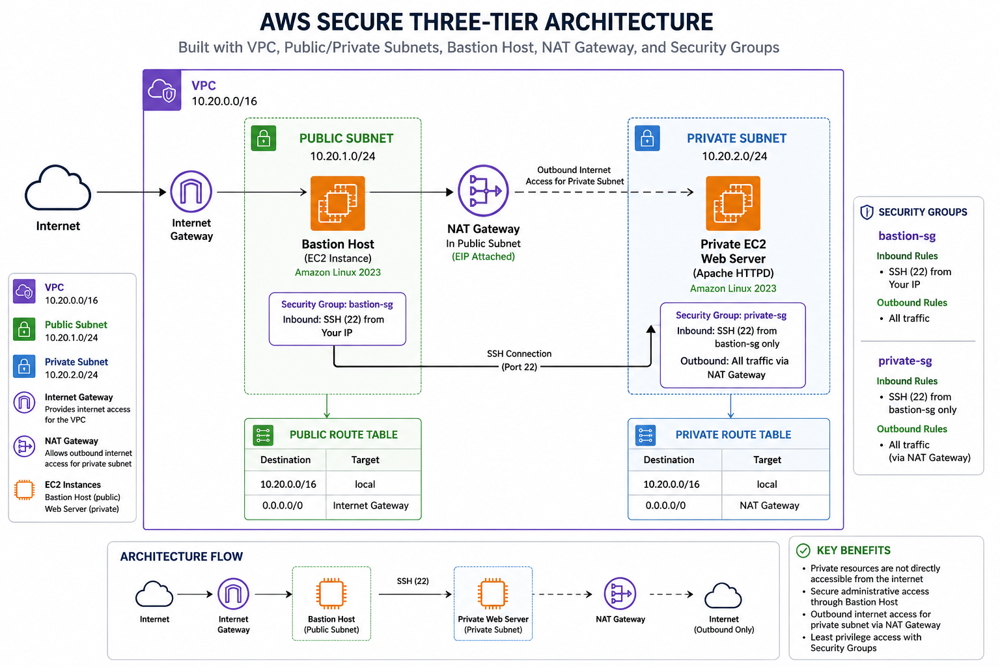

# AWS Secure Three-Tier Architecture

## Project Overview

This project demonstrates the implementation of a secure AWS Three-Tier Architecture using industry best practices.

The environment consists of:

- Public Subnet
- Private Subnet
- Bastion Host
- Private Web Server
- NAT Gateway
- Internet Gateway
- Security Groups
- Route Tables
- Amazon Linux 2023
- Apache HTTP Server

The objective of this project is to demonstrate secure cloud networking, network segmentation, and secure administration of private resources within AWS.

---

# Architecture Diagram



---

# Architecture

```
Internet
    │
    ▼
Internet Gateway
    │
    ▼
Public Subnet
    │
    ├── Bastion Host
    │
    └── NAT Gateway
              │
              ▼
Private Subnet
       │
       ▼
Apache Web Server
```

---

# Technologies Used

- Amazon EC2
- Amazon VPC
- Internet Gateway
- NAT Gateway
- Route Tables
- Security Groups
- Amazon Linux 2023
- Apache
- SSH

---

# Project Screenshots

## VPC Overview


---

## Public and Private Subnets


---

## Internet Gateway


---

## Public Route Table


---

## Private Route Table


---

## NAT Gateway


---

## EC2 Instances


---

## Security Groups


---

## Apache Running


---

## Custom Web Page


---

# Skills Demonstrated

- AWS Networking
- Cloud Security
- Amazon VPC
- Bastion Host Administration
- Linux Administration
- Apache Web Server
- NAT Gateway
- Internet Gateway
- Route Tables
- Security Groups
- SSH
- Public & Private Networking

---

# Lessons Learned

During this project I learned how to:

- Build a secure VPC architecture
- Configure Public and Private Subnets
- Implement Bastion Host administration
- Configure NAT Gateway for outbound Internet access
- Secure EC2 instances using Security Groups
- Configure Apache on Amazon Linux 2023
- Troubleshoot Linux and AWS networking
- Connect securely to private instances through SSH

---

# Author

## Boama Osei-Owusu

CompTIA Security+ | CompTIA Cloud+ | AWS Cloud Projects | U.S. Army Reserve | Secret Clearance

LinkedIn:

https://www.linkedin.com/in/boama-osei-owusu-526628b5

